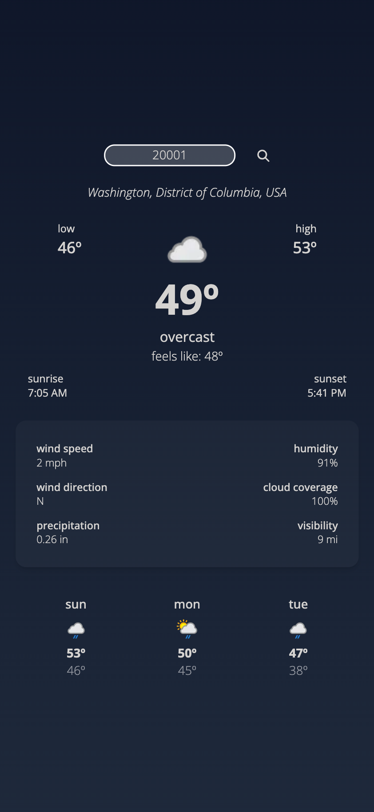

# Shyne Weather App

## Overview
Shyne Weather App is a web application that utilizes the OpenWeather API to display weather data based on user input of a city or zip code. It is built using React and styled with Tailwind CSS. The primary objective of this project is to demonstrate proficiency in consuming API data and displaying it dynamically, as well as showcasing the ability to develop a Single Page Application (SPA).

## Features
- **Weather Data Display**: Users can input a city name or zip code to retrieve current weather data, including temperature, humidity, wind speed, and weather conditions.
- **Responsive Design**: The application is designed to be responsive across various devices, ensuring optimal user experience on both desktop and mobile platforms.
- **Error Handling**: Proper error handling is implemented to provide feedback to users in case of invalid input or API request failures.

## Technologies Used
- **React**: Utilized for building the SPA structure and managing state efficiently.
- **OpenWeather API**: Integrated to fetch real-time weather data based on user input.
- **Tailwind CSS**: Used for styling the user interface with utility-first CSS classes, providing flexibility and maintainability.

## Usage
1. Fork and clone the repository to your local machine.
2. Navigate to the project directory.
3. Install dependencies using `npm install`.
4. Obtain an API key from [OpenWeather](https://openweathermap.org/) and replace `YOUR_API_KEY` in the code with your actual API key.
5. Run the application using `npm start`.
6. Access the application in your web browser at `http://localhost:3000`.

## Demo
You can access a live demo of the Shyne Weather App here: https://shyne-weather.web.app/.

## Credits
This project was created by *Ariela Israel*.

## License
This project is licensed under the [MIT License](LICENSE).
